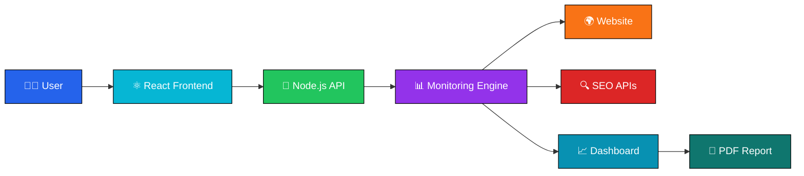
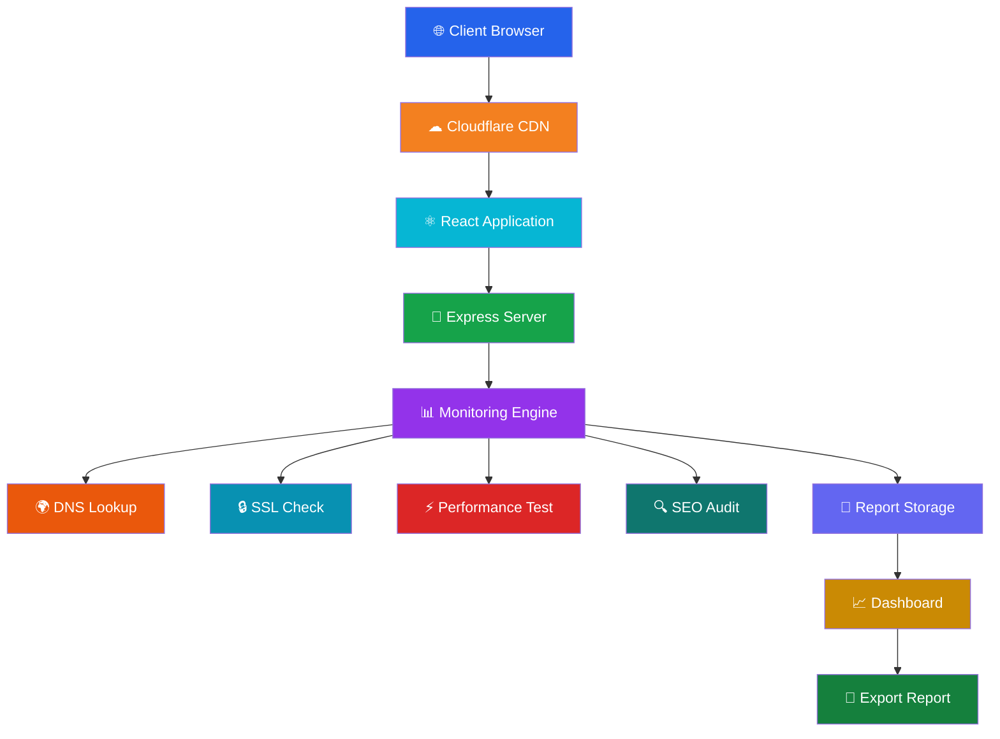
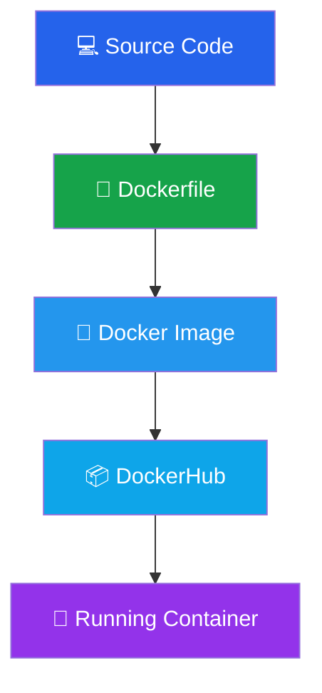
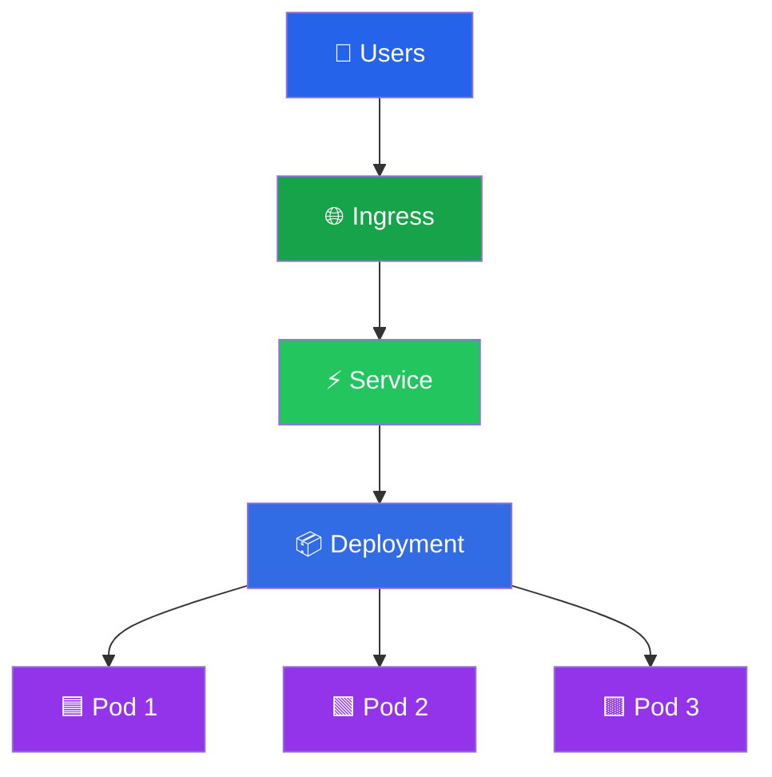
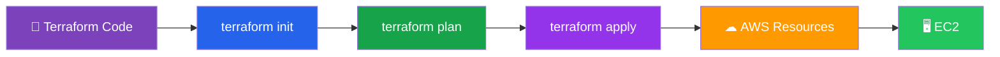
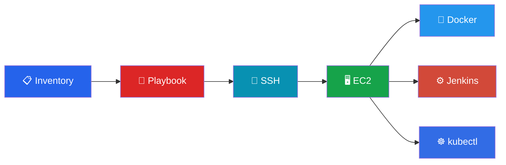
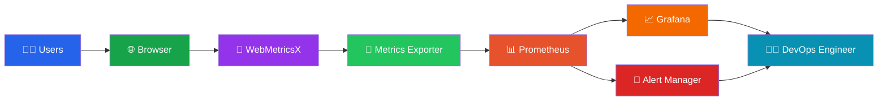
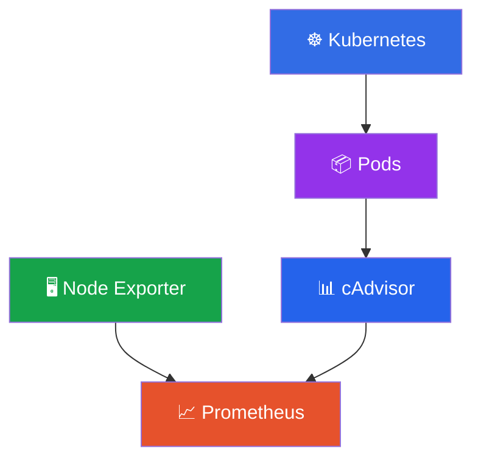

# 🚀 WebMetricsX

<div align="center">

# 🌐 Enterprise Website Monitoring Platform

### 📊 Real-Time Website Monitoring • ⚡ DevOps Automation • ☁️ Cloud Native • 🚀 CI/CD Deployment

<p align="center">


</p>


</div>

---

# 📖 About WebMetricsX

**WebMetricsX** is a **production-ready enterprise website monitoring platform** designed to continuously monitor websites, analyze SEO performance, measure response time, detect failures, and visualize live metrics using modern DevOps technologies.

Unlike basic monitoring tools, WebMetricsX integrates a **complete DevOps ecosystem** including:

- 🚀 Jenkins CI/CD
- 🐳 Docker
- ☸ Kubernetes
- ☁ AWS EC2
- 🏗 Terraform
- 🤖 Ansible
- 📊 Prometheus
- 📈 Grafana

to deliver an automated, scalable, cloud-native monitoring solution.

---

# ✨ Key Features

## 🌍 Website Monitoring

- Live Website Status
- HTTP Status Monitoring
- DNS Lookup
- SSL Validation
- TTFB Analysis
- Response Time Tracking
- Availability Monitoring

---

## 📊 Analytics

- Performance Monitoring
- Website Speed
- Core Web Vitals
- SEO Analysis
- Performance Score
- Accessibility Report
- Best Practices Audit

---

## 📈 Dashboard

- Beautiful Charts
- Live Statistics
- Auto Refresh (Every 5 Seconds)
- Interactive UI
- Responsive Design

---

## 📄 Reporting

- PDF Report Export
- Website Summary
- SEO Summary
- Performance Report

---

## ⚙ DevOps

- Jenkins Pipeline
- Docker Containerization
- DockerHub Image Registry
- Kubernetes Deployment
- Terraform Infrastructure
- Ansible Automation
- Prometheus Monitoring
- Grafana Dashboards

---

# 🏗 High Level Architecture



---

# 🏢 Enterprise System Architecture



---

# 🔄 Monitoring Workflow


---

# 📸 Application Preview

## 🖥 Dashboard


---

## 📊 Performance


---

## 🔍 SEO Analysis


---

## 📄 PDF Report


---

---

# 🚀 DevOps Architecture

WebMetricsX follows a **production-ready DevOps workflow** where every code change is automatically built, tested, containerized, deployed, and monitored.

## 🔥 DevOps Workflow


---

# ⚙ Continuous Integration & Continuous Deployment

Every push to GitHub automatically triggers a Jenkins pipeline that builds, tests, packages, and deploys the application.

## 🔄 CI/CD Pipeline


---

# 🐳 Docker Architecture

Docker is used to package the complete application into portable containers.

## Container Architecture



### 📸 Docker Build


---

### 📸 DockerHub Images


---

# ☸ Kubernetes Deployment

Kubernetes manages application deployment, scaling, and availability.

## Kubernetes Architecture



### Kubernetes Features

- ReplicaSets
- Rolling Updates
- Self-Healing Pods
- Auto Scheduling
- Service Discovery
- Load Balancing
- Horizontal Scaling

---

### 📸 Deployments


---

### 📸 Services


---

# ☁ AWS Infrastructure

The application is hosted on AWS EC2 using Infrastructure as Code.


---

# 🏗 Infrastructure as Code (Terraform)

Terraform provisions cloud infrastructure automatically.

## Terraform Workflow



### 📸 Terraform Output


---

# 🤖 Configuration Management (Ansible)

Ansible automates complete server provisioning.



### Automated Installation

- Docker Engine
- Jenkins
- kubectl
- Git
- Required Packages
- User Permissions

### 📸 Ansible Execution


---

---

# 📊 Monitoring & Observability

WebMetricsX is equipped with a complete **cloud-native monitoring stack** to provide real-time visibility into application health, infrastructure performance, and Kubernetes workloads.

The monitoring stack collects metrics from containers, Kubernetes resources, and system components, then visualizes them through interactive Grafana dashboards.

---

# 🏗 Monitoring Architecture



---

# 📊 Prometheus Metrics Collection



---

# 📈 Grafana Dashboard

Grafana provides rich dashboards for visualizing:

- CPU Usage
- Memory Utilization
- Network Traffic
- Pod Status
- Container Health
- HTTP Requests
- Response Time
- Kubernetes Metrics

### 📸 Grafana Dashboard

> Replace with your Grafana dashboard screenshot.

```text
public/grafana-dashboard.png
```

---

# 📊 Prometheus UI

Prometheus continuously scrapes metrics from exporters and Kubernetes resources.

### 📸 Prometheus UI

> Replace with your Prometheus UI screenshot.

```text
public/prometheus.png
```

---

# 📂 Project Structure

```text
WebMetricsX
│
├── frontend
│   ├── public
│   ├── src
│   ├── components
│   ├── pages
│   ├── hooks
│   └── utils
│
├── backend
│   ├── controllers
│   ├── routes
│   ├── middleware
│   ├── services
│   ├── config
│   └── server.js
│
├── docker
│   ├── Dockerfile
│   └── docker-compose.yml
│
├── kubernetes
│   ├── deployment.yaml
│   ├── service.yaml
│   ├── ingress.yaml
│   └── namespace.yaml
│
├── terraform
│   ├── main.tf
│   ├── variables.tf
│   └── outputs.tf
│
├── ansible
│   ├── inventory
│   ├── playbook.yml
│   └── roles
│
├── jenkins
│   └── Jenkinsfile
│
├── monitoring
│   ├── prometheus.yml
│   └── grafana
│
└── README.md
```

---

# 🛠 Tech Stack

## Frontend

- React.js
- Tailwind CSS
- Chart.js
- Axios

---

## Backend

- Node.js
- Express.js
- REST API

---

## DevOps

- Docker
- Docker Compose
- Jenkins
- GitHub Actions *(Optional)*
- Kubernetes
- Terraform
- Ansible
- AWS EC2

---

## Monitoring

- Prometheus
- Grafana
- Node Exporter
- cAdvisor

---

## Version Control

- Git
- GitHub

---

# 🚀 Installation

Clone the repository:

```bash
git clone https://github.com/Saurav6200907210/webmetrics-e2e-devops-project.git
```

Move into the project directory:

```bash
cd webmetrics-e2e-devops-project
```

Install dependencies:

```bash
npm install
```

Run the frontend:

```bash
npm run dev
```

Run the backend:

```bash
npm start
```

---

# 🐳 Docker

Build the image:

```bash
docker build -t webmetrics .
```

Run the container:

```bash
docker run -p 3000:3000 webmetrics
```

---

# ☸ Kubernetes

Deploy all resources:

```bash
kubectl apply -f kubernetes/
```

Check Pods:

```bash
kubectl get pods
```

Check Services:

```bash
kubectl get svc
```

---

# ⚙ Terraform

Initialize Terraform:

```bash
terraform init
```

Create execution plan:

```bash
terraform plan
```

Provision infrastructure:

```bash
terraform apply
```

---

# 🤖 Ansible

Execute the playbook:

```bash
ansible-playbook playbook.yml
```

---

# 🎯 Project Highlights

- ✅ Real-Time Website Monitoring
- ✅ SEO Analysis
- ✅ Performance Metrics
- ✅ Automated PDF Reports
- ✅ Jenkins CI/CD
- ✅ Dockerized Application
- ✅ Kubernetes Deployment
- ✅ Terraform Infrastructure
- ✅ Ansible Automation
- ✅ AWS Deployment
- ✅ Prometheus Monitoring
- ✅ Grafana Dashboards
- ✅ Production-Ready Architecture

---

# 🚀 Future Enhancements

- 🔐 User Authentication
- 🌍 Multi-Region Deployment
- 📱 Mobile Dashboard
- 🤖 AI-Based Performance Insights
- 🔔 Slack & Email Alerts
- 📩 Webhook Notifications
- 🌐 Multi-Cloud Deployment
- 📦 Helm Charts
- ⚡ ArgoCD GitOps Deployment
- 📊 Loki Log Aggregation

---

# 💼 Resume Highlights

- Designed and developed a **production-ready full-stack website monitoring platform**.
- Built an **automated CI/CD pipeline using Jenkins**.
- Containerized the application using **Docker**.
- Deployed workloads on **Kubernetes**.
- Provisioned AWS infrastructure using **Terraform**.
- Automated server configuration using **Ansible**.
- Implemented **Prometheus + Grafana** for monitoring and observability.
- Followed cloud-native DevOps best practices for scalable deployments.

---

# 📌 Release

### 🚀 Version 1.0.0

Initial enterprise release featuring:

- Website Monitoring
- DevOps Automation
- CI/CD Pipeline
- Kubernetes Deployment
- Monitoring Stack
- Infrastructure Automation

---

# 🤝 Contributing

Contributions are welcome!

1. Fork the repository
2. Create a feature branch
3. Commit your changes
4. Push your branch
5. Open a Pull Request

---

# ⭐ Support

If you found this project useful, please consider giving it a **⭐ Star** on GitHub.

It helps the project reach more developers and motivates future improvements.

---

# 📜 License

This project is licensed under the **MIT License**.

---

<div align="center">

## 🚀 Built with ❤️ by Saurav Kumar

### Full Stack Developer • DevOps Engineer • Cloud Enthusiast

**If you like this project, don't forget to ⭐ Star the repository!**

</div>
