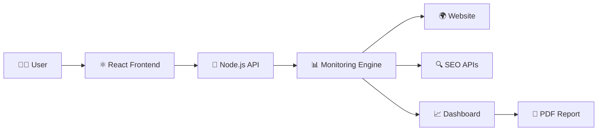
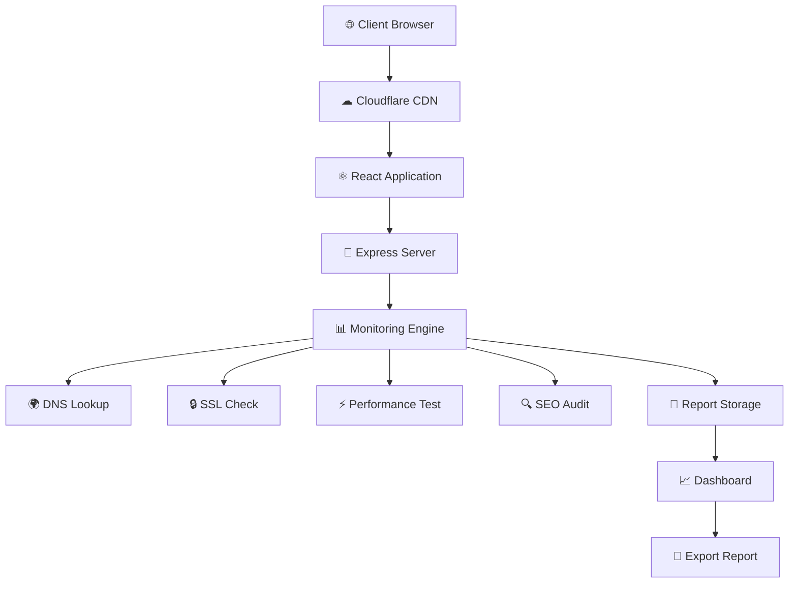
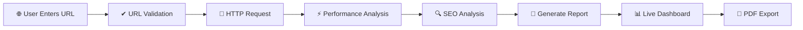
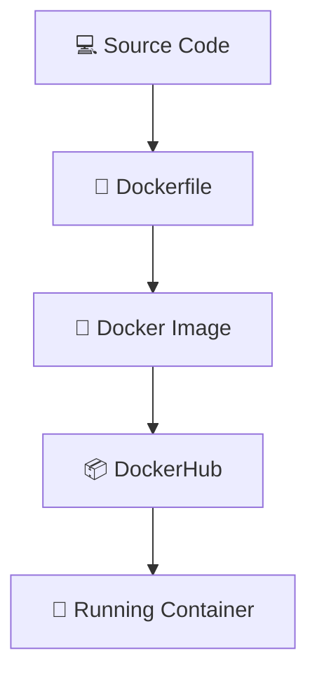
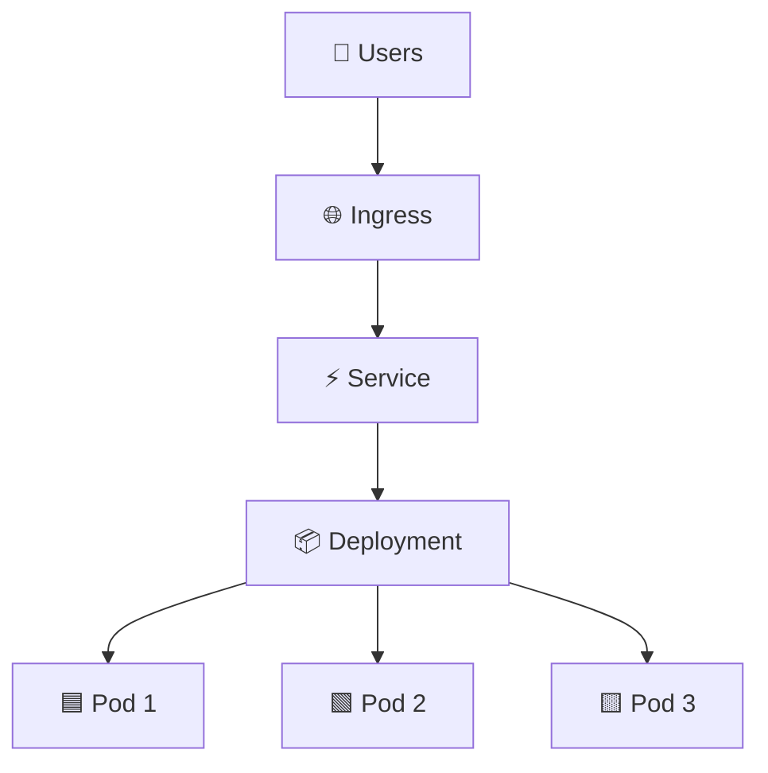
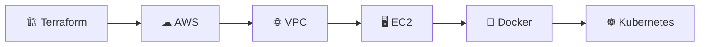
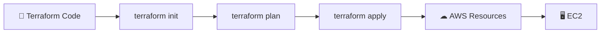
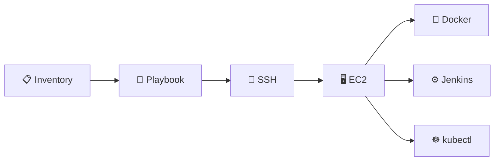
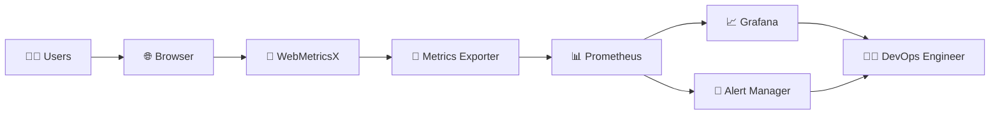
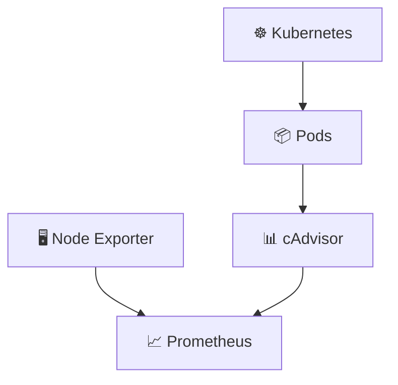

# 🚀 WebMetricsX

<div align="center">

# 🌐 Enterprise Website Monitoring Platform

### 📊 Real-Time Website Monitoring • ⚡ DevOps Automation • ☁️ Cloud Native • 🚀 CI/CD Deployment

<p align="center">


</p>


</div>

---

## 📖 About WebMetricsX

**WebMetricsX** ek production-ready enterprise website monitoring platform hai jo websites ko continuously monitor karta hai, SEO performance analyze karta hai, response time measure karta hai, failures detect karta hai, aur live metrics ko modern DevOps technologies ke saath visualize karta hai.

Basic monitoring tools se alag, WebMetricsX ek **complete DevOps ecosystem** integrate karta hai:

- 🚀 **Jenkins CI/CD** – Automated build, test, deploy
- 🐳 **Docker** – Containerization for portability
- ☸ **Kubernetes** – Orchestration for scaling & availability
- ☁ **AWS EC2** – Cloud infrastructure
- 🏗 **Terraform** – Infrastructure as Code
- 🤖 **Ansible** – Server configuration automation
- 📊 **Prometheus + Grafana** – Real-time monitoring & dashboards

Ye project end-to-end DevOps automation demonstrate karta hai — code commit se lekar deployment, scaling, aur monitoring tak.

> 💡 **Note for Recruiters:** Ye project originally AWS EC2 pe deploy kiya gaya tha. Cost optimization ke liye ab local Kubernetes (minikube/kind) pe manage kiya jata hai. Terraform scripts cloud-agnostic hain aur AWS, Azure, GCP, Oracle Cloud — kisi pe bhi deploy ho sakte hain.

---

## ✨ Key Features

### 🌍 Website Monitoring
- Live Website Status
- HTTP Status Monitoring
- DNS Lookup
- SSL Validation
- TTFB (Time to First Byte) Analysis
- Response Time Tracking
- Availability Monitoring

### 📊 Analytics
- Performance Monitoring
- Website Speed Metrics
- Core Web Vitals
- SEO Analysis
- Performance Score
- Accessibility Report
- Best Practices Audit

### 📈 Dashboard
- Beautiful Charts (Chart.js)
- Live Statistics
- Auto Refresh (Every 5 Seconds)
- Interactive UI
- Responsive Design

### 📄 Reporting
- PDF Report Export
- Website Summary
- SEO Summary
- Performance Report

### ⚙ DevOps
- Jenkins Pipeline (CI/CD)
- Docker Containerization
- DockerHub Image Registry
- Kubernetes Deployment
- Terraform Infrastructure as Code
- Ansible Configuration Management
- Prometheus Monitoring
- Grafana Dashboards

---

## 🏗 High-Level Architecture


```mermaid
flowchart LR
User["👨‍💻 User"] --> React["⚛ React Frontend"]
React --> Node["🚀 Node.js API"]
Node --> Monitor["📊 Monitoring Engine"]
Monitor --> API["🌍 Website"]
Monitor --> SEO["🔍 SEO APIs"]
Monitor --> Charts["📈 Dashboard"]
Charts --> PDF["📄 PDF Report"]
```

---

## 🏢 Enterprise System Architecture


```mermaid
flowchart TD
Client["🌐 Client Browser"] --> Cloudflare["☁ Cloudflare CDN"]
Cloudflare --> Frontend["⚛ React Application"]
Frontend --> Backend["🚀 Express Server"]
Backend --> Engine["📊 Monitoring Engine"]
Engine --> DNS["🌍 DNS Lookup"]
Engine --> SSL["🔒 SSL Check"]
Engine --> Performance["⚡ Performance Test"]
Engine --> SEO["🔍 SEO Audit"]
Engine --> Database["💾 Report Storage"]
Database --> Charts["📈 Dashboard"]
Charts --> PDF["📄 Export Report"]
```

---

## 🔄 Monitoring Workflow


```mermaid
flowchart LR
Start["🌐 User Enters URL"] --> Validate["✔ URL Validation"]
Validate --> Request["📡 HTTP Request"]
Request --> Analyze["⚡ Performance Analysis"]
Analyze --> SEO["🔍 SEO Analysis"]
SEO --> Store["💾 Generate Report"]
Store --> Dashboard["📊 Live Dashboard"]
Dashboard --> PDF["📄 PDF Export"]
```

---

## 📸 Application Preview

### 🖥 Dashboard


### 📊 Performance


### 🔍 SEO Analysis


### 📄 PDF Report


---

## 🚀 DevOps Architecture

WebMetricsX ek production-ready DevOps workflow follow karta hai jahan har code change automatically build, test, containerize, deploy, aur monitor hota hai.

### 🔥 DevOps Workflow


```mermaid
flowchart LR
Developer["👨‍💻 Developer"] --> Git["📂 Git"]
Git --> GitHub["🐙 GitHub"]
GitHub --> Webhook["🔔 GitHub Webhook"]
Webhook --> Jenkins["⚙ Jenkins Pipeline"]
Jenkins --> Docker["🐳 Docker Build"]
Docker --> DockerHub["📦 DockerHub"]
DockerHub --> Kubernetes["☸ Kubernetes"]
Kubernetes --> Service["🌐 Kubernetes Service"]
Service --> Users["👥 End Users"]
```

---

## ⚙ Continuous Integration & Continuous Deployment (CI/CD)

Har GitHub push automatically Jenkins pipeline trigger karta hai jo application ko build, test, package, aur deploy karta hai.

### 🔄 CI/CD Pipeline


```mermaid
flowchart LR
Push["📤 Git Push"] --> GitHub["🐙 GitHub"]
GitHub --> Webhook["🔔 Webhook"]
Webhook --> Jenkins["⚙ Jenkins"]
Jenkins --> Checkout["📥 Checkout Code"]
Checkout --> Build["🔨 Build"]
Build --> Test["✅ Test"]
Test --> Docker["🐳 Docker Build"]
Docker --> PushImage["📦 Push Docker Image"]
PushImage --> Deploy["☸ Kubernetes Deploy"]
Deploy --> Production["🚀 Live Production"]
```

**Pipeline Stages:**
1. **Checkout** – GitHub se code pull
2. **Build** – npm install + Vite build
3. **Test** – Vitest test execution
4. **Docker Build** – Docker image create
5. **Docker Push** – DockerHub pe push
6. **Deploy** – Kubernetes pe apply
7. **Monitor** – Prometheus + Grafana

---

## 🐳 Docker Architecture

Docker pure application ko portable containers me package karta hai.

### Container Architecture


```mermaid
flowchart TB
Source["💻 Source Code"] --> Dockerfile["📄 Dockerfile"]
Dockerfile --> Image["🐳 Docker Image"]
Image --> Registry["📦 DockerHub"]
Registry --> Container["🚀 Running Container"]
```

### 📸 Docker Build


### 📸 DockerHub Images


---

## ☸ Kubernetes Deployment

Kubernetes application deployment, scaling, aur availability manage karta hai.

### Kubernetes Architecture


```mermaid
flowchart TB
Users["👥 Users"] --> Ingress["🌐 Ingress"]
Ingress --> Service["⚡ Service"]
Service --> Deployment["📦 Deployment"]
Deployment --> Pod1["🟦 Pod 1"]
Deployment --> Pod2["🟩 Pod 2"]
Deployment --> Pod3["🟨 Pod 3"]
```

### Kubernetes Features
- ✅ ReplicaSets
- ✅ Rolling Updates
- ✅ Self-Healing Pods
- ✅ Auto Scheduling
- ✅ Service Discovery
- ✅ Load Balancing
- ✅ Horizontal Scaling

### 📸 Deployments


### 📸 Services


---

## ☁ AWS Infrastructure

Ye application originally **AWS EC2** pe Infrastructure as Code ke through host kiya gaya tha.

> 💡 **Cost Optimization Note:** AWS bills se bachne ke liye ab infrastructure local Kubernetes (minikube/kind) pe run hota hai. Terraform scripts cloud-agnostic hain — AWS, Azure, GCP, Oracle Cloud kisi pe bhi deploy ho sakte hain.

### AWS Architecture


```mermaid
flowchart LR
Terraform["🏗 Terraform"] --> AWS["☁ AWS"]
AWS --> VPC["🌐 VPC"]
VPC --> EC2["🖥 EC2"]
EC2 --> Docker["🐳 Docker"]
Docker --> Kubernetes["☸ Kubernetes"]
```

---

## 🏗 Infrastructure as Code (Terraform)

Terraform cloud infrastructure automatically provision karta hai.

### Terraform Workflow


```mermaid
flowchart LR
Code["📝 Terraform Code"] --> Init["terraform init"]
Init --> Plan["terraform plan"]
Plan --> Apply["terraform apply"]
Apply --> AWS["☁ AWS Resources"]
AWS --> EC2["🖥 EC2"]
```

### 📸 Terraform Output


---

## 🤖 Configuration Management (Ansible)

Ansible complete server provisioning automate karta hai.

### Ansible Workflow


```mermaid
flowchart LR
Inventory["📋 Inventory"] --> Playbook["📄 Playbook"]
Playbook --> SSH["🔐 SSH"]
SSH --> Target["🖥 EC2"]
Target --> Docker["🐳 Docker"]
Target --> Jenkins["⚙ Jenkins"]
Target --> Kubectl["☸ kubectl"]
```

### Automated Installation
- ✅ Docker Engine
- ✅ Jenkins
- ✅ kubectl
- ✅ Git
- ✅ Required Packages
- ✅ User Permissions

### 📸 Ansible Execution


---

## 📊 Monitoring & Observability

WebMetricsX ek complete **cloud-native monitoring stack** ke saath aata hai jo application health, infrastructure performance, aur Kubernetes workloads ki real-time visibility provide karta hai.

### Monitoring Architecture


```mermaid
flowchart LR
Users["👨‍💻 Users"] --> Browser["🌐 Browser"]
Browser --> Application["🚀 WebMetricsX"]
Application --> Exporter["📡 Metrics Exporter"]
Exporter --> Prometheus["📊 Prometheus"]
Prometheus --> Grafana["📈 Grafana"]
Prometheus --> Alerts["🚨 Alert Manager"]
Grafana --> Admin["👨‍💼 DevOps Engineer"]
Alerts --> Admin
```

### Prometheus Metrics Collection


```mermaid
flowchart TB
Kubernetes["☸ Kubernetes"] --> Pods["📦 Pods"]
Pods --> cAdvisor["📊 cAdvisor"]
NodeExporter["🖥 Node Exporter"] --> Prometheus["📈 Prometheus"]
cAdvisor --> Prometheus
```

### 📈 Grafana Dashboard Metrics
- ✅ CPU Usage
- ✅ Memory Utilization
- ✅ Network Traffic
- ✅ Pod Status
- ✅ Container Health
- ✅ HTTP Requests
- ✅ Response Time
- ✅ Kubernetes Metrics

### 📸 Grafana Dashboard
> Apna Grafana dashboard screenshot yahan add karein: `public/grafana-dashboard.png`

### 📊 Prometheus UI
> Apna Prometheus UI screenshot yahan add karein: `public/prometheus.png`

---

## 📂 Project Structure


---

## 🛠 Tech Stack

### Frontend
- React.js
- Tailwind CSS
- Chart.js
- Axios

### Backend
- Node.js
- Express.js
- REST API

### DevOps
- Docker
- Docker Compose
- Jenkins
- GitHub Actions (Optional)
- Kubernetes
- Terraform
- Ansible
- AWS EC2

### Monitoring
- Prometheus
- Grafana
- Node Exporter
- cAdvisor

### Version Control
- Git
- GitHub

---

## 🚀 Installation & Deployment

### Local Development
```bash
git clone https://github.com/Saurav6200907210/WebMetricsX.git
cd WebMetricsX
npm install
npm run dev        # Frontend
npm start          # Backend
```

### Docker
```bash
docker build -t webmetrics .
docker run -p 3000:3000 webmetrics
# Or
docker-compose up -d
```

### Kubernetes
```bash
kubectl apply -f kubernetes/
kubectl get pods
kubectl get svc
kubectl port-forward svc/webmetrics 3000:80
```

### Terraform
```bash
terraform init
terraform plan
terraform apply
terraform destroy  # To avoid bills
```

### Ansible
```bash
ansible-playbook playbook.yml
```

---

## 🎯 Project Highlights (Recruiter Summary)

- ✅ **Real-Time Website Monitoring** – Live status, SSL, DNS, TTFB, response time
- ✅ **SEO & Performance Analysis** – Core Web Vitals, accessibility, best practices
- ✅ **Automated PDF Reports** – Exportable reports for stakeholders
- ✅ **Jenkins CI/CD** – Fully automated build, test, deploy pipeline
- ✅ **Dockerized Application** – Portable, reproducible builds
- ✅ **Kubernetes Deployment** – High availability, auto-scaling, rolling updates
- ✅ **Terraform IaC** – Cloud infrastructure automation (AWS, Azure, GCP, Oracle)
- ✅ **Ansible Automation** – Server provisioning & configuration
- ✅ **Prometheus + Grafana** – Production-grade monitoring & dashboards
- ✅ **Production-Ready Architecture** – Enterprise-grade system design

---

## 🚀 Future Enhancements

- 🔐 User Authentication
- 🌍 Multi-Region Deployment
- 📱 Mobile Dashboard
- 🤖 AI-Based Performance Insights
- 🔔 Slack & Email Alerts (via Alertmanager)
- 📩 Webhook Notifications
- 🌐 Multi-Cloud Deployment
- 📦 Helm Charts
- ⚡ ArgoCD GitOps Deployment
- 📊 Loki Log Aggregation

---

## 💼 Resume Highlights (Ready-to-Use)

- Designed and developed a **production-ready full-stack website monitoring platform** using React, Node.js, and Express.
- Built an **automated CI/CD pipeline using Jenkins** for build, test, and deployment.
- Containerized the application using **Docker** and published to DockerHub.
- Deployed workloads on **Kubernetes** with high availability, scaling, and rolling updates.
- Provisioned cloud infrastructure using **Terraform** (AWS EC2, VPC) and automated server configuration using **Ansible**.
- Implemented **Prometheus + Grafana** for real-time monitoring and observability.
- Followed cloud-native DevOps best practices for scalable, production-ready deployments.
- Optimized cloud costs by migrating from AWS EC2 to local Kubernetes while maintaining full DevOps workflow.

---

## 📌 Release

### 🚀 Version 1.0.0 – Initial Enterprise Release
- ✅ Website Monitoring
- ✅ DevOps Automation
- ✅ CI/CD Pipeline
- ✅ Kubernetes Deployment
- ✅ Monitoring Stack
- ✅ Infrastructure Automation

---

## 🤝 Contributing

Contributions welcome hain!

1. Fork the repository
2. Create a feature branch
3. Commit your changes
4. Push your branch
5. Open a Pull Request

---

## ⭐ Support

Agar ye project useful laga ho to **⭐ Star** zaroor dena GitHub pe. Ye project ko aur developers tak pahunchane me help karta hai.

---

## 📜 License

MIT License

---

<div align="center">

## 🚀 Built with ❤️ by Saurav Kumar

### Full Stack Developer • DevOps Engineer • Cloud Enthusiast

**GitHub:** [@Saurav6200907210](https://github.com/Saurav6200907210)  
**Live Demo:** [web-metrics-x.vercel.app](https://web-metrics-x.vercel.app/)

**If you like this project, don't forget to ⭐ Star the repository!**

</div>
